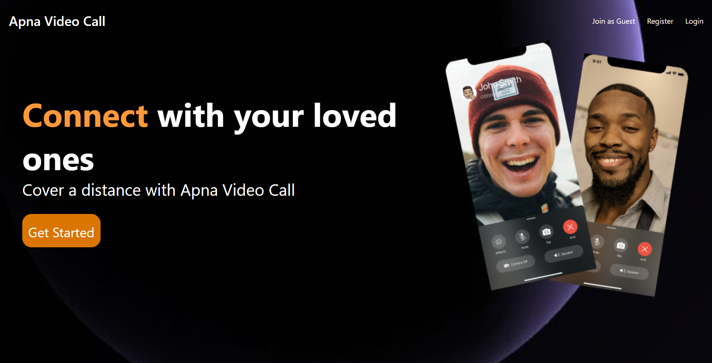
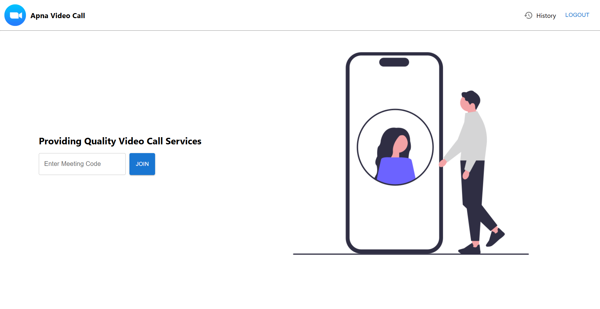

<div align="center">
  
  <h1>Video Conferencing Platform <br/>- Apna Video Call</h1>
  

  <p>
    <strong>Connect seamlessly with high-quality video, audio, and secure authentication.</strong>
  </p>

  <p>
    <a href="https://apnavideocall-f97q.onrender.com">
      
    </a>
  </p>

  <p>
    <a href="#key-features">Key Features</a> •
    <a href="#tech-stack">Tech Stack</a> •
    <a href="#getting-started">Getting Started</a> •
    <a href="#contributing">Contributing</a>
  </p>

  
  
  
  
  
  
</div>

---

## 📖 Introduction

Welcome to the **Video Conferencing Platform**, a robust and modern application designed to facilitate real-time communication. key features include secure user authentication, meeting history tracking, and seamless video meetings powered by WebRTC and Socket.io. Built with the MERN stack, it offers a responsive and intuitive user interface.

## ✨ Key Features

*   **🎥 Real-time Video Conferencing:** High-quality video and audio streaming for seamless meetings.
*   **🔒 Secure Authentication:** Robust user registration and login system ensuring data privacy.
*   **📜 Meeting History:** Keep track of past meetings and join details.
*   **📱 Responsive Design:** Optimized for various devices, ensuring a great experience on desktop and mobile.
*   **⚡ Real-time Interaction:** Instant connection and updates using Socket.io.

## 🛠️ Tech Stack

This project harnesses the power of the MERN stack along with other modern technologies:

### Frontend
*   **[React.js](https://reactjs.org/)**: Library for building user interfaces.
*   **[Material UI (MUI)](https://mui.com/)**: React component library for faster and easier web development.
*   **[Context API](https://reactjs.org/docs/context.html)**: State management.
*   **[Socket.io-client](https://socket.io/docs/v4/client-api/)**: Real-time bidirectional event-based communication.

### Backend
*   **[Node.js](https://nodejs.org/)**: JavaScript runtime environment.
*   **[Express.js](https://expressjs.com/)**: Web framework for Node.js.
*   **[MongoDB](https://www.mongodb.com/)**: NoSQL database for flexible data storage.
*   **[Mongoose](https://mongoosejs.com/)**: Object Data Modeling (ODM) library for MongoDB and Node.js.
*   **[Socket.io](https://socket.io/)**: Enables real-time, bidirectional and event-based communication.

## 🚀 Getting Started

Follow these steps to get a local copy up and running.

### Prerequisites

*   [Node.js](https://nodejs.org/en/download/) (v14 or higher)
*   [MongoDB](https://www.mongodb.com/try/download/community) (Local or Atlas)

### Installation

1.  **Clone the repository**
    ```bash
    git clone https://github.com/SahilShinde108/Video-Conferencing-Platform.git
    cd Video-Conferencing-Platform
    ```

2.  **Backend Setup**
    Navigate to the backend directory and install dependencies:
    ```bash
    cd backend
    npm install
    ```
    Create a `.env` file in the `backend` directory and add your variables:
    ```env
    MONGO_URL=your_mongodb_connection_string
    PORT=8080
    ```
    Start the backend server:
    ```bash
    npm start
    ```

3.  **Frontend Setup**
    Open a new terminal, navigate to the frontend directory and install dependencies:
    ```bash
    cd ../frontend
    npm install
    ```
    Start the frontend application:
    ```bash
    npm start
    ```

Your application should now be running on `http://localhost:3000`.

## 📸 Screenshots

<div align="center">
  
  <h3>Landing Page</h3>
</div>

<div align="center">
  
  <h3>Home Page</h3>
</div>

<div align="center">
  
  <h3>Meeting Room</h3>
</div>

## 🤝 Contributing

Contributions are what make the open source community such an amazing place to learn, inspire, and create. Any contributions you make are **greatly appreciated**.

1.  Fork the Project
2.  Create your Feature Branch (`git checkout -b feature/AmazingFeature`)
3.  Commit your Changes (`git commit -m 'Add some AmazingFeature'`)
4.  Push to the Branch (`git push origin feature/AmazingFeature`)
5.  Open a Pull Request


---

<div align="center">
  Made with ❤️ by <a href="https://github.com/SahilShinde108">Sahil Shinde</a>
</div>
